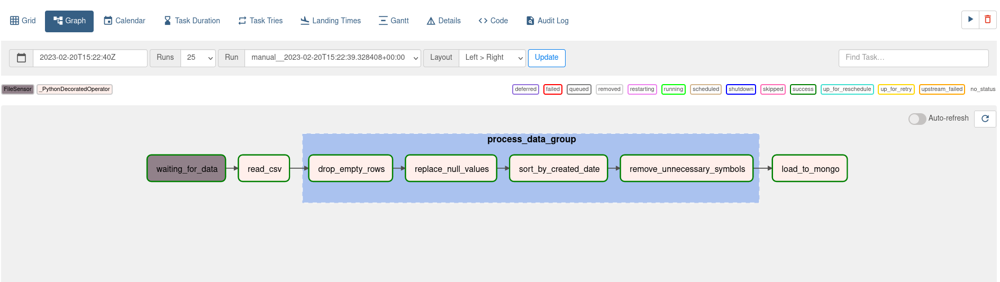
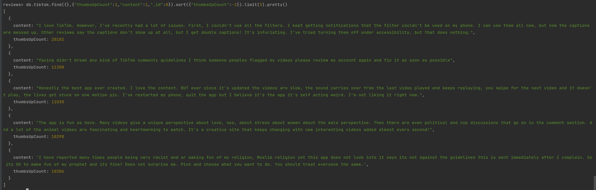
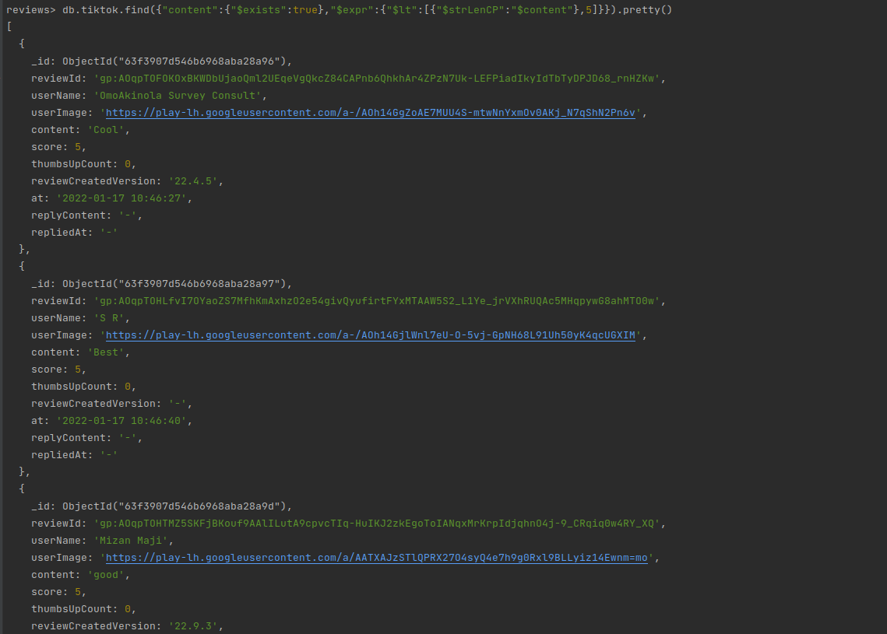
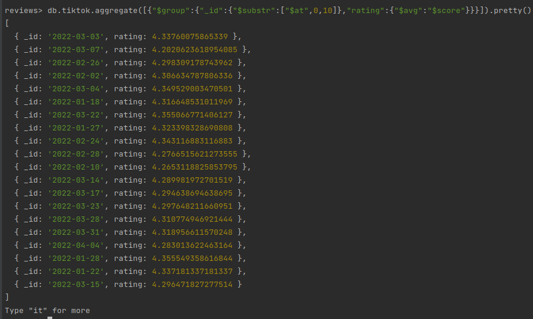

# Airflow

## Docker and Celery worker
All Airflow daemons + Mongo DB daemon + Postgresql daemon and Celery worker are wrapped in container with [Docker](https://www.docker.com/).

All declaration of Docker containers are described in [docker-compose.yaml](docker-compose.yaml).
Requirements installation is described in [Dockerfile](Dockerfile).

_Note: in [Dockerfile](Dockerfile) **BuildKit** is used for saving time while updating Python pip requirements.
It may be necessary to export `DOCKER_BUILDKIT=1` variable in your host. See more details on [Docker documentation](https://docs.docker.com/build/buildkit/#getting-started)._

To build and run Docker containers use:

```shell 
docker compose up --build 
```


## Results

DAG's visualization:



## Queries

To execute queries you need to start Mongo shell. To do that execute:

```shell
docker exec -it mongodb mongosh -u admin 
```

_Note: username and password are stored in [.env](.env)._

**Important:** before doing queries DAG must be completed.

Select `review` database:

```shell
use reviews
```

Finally, queries...

- Top 5 popular comments
```shell
db.tiktok.find({},{"thumbsUpCount":1,"content":1,"_id":0}).sort({"thumbsUpCount":-1}).limit(5).pretty()
```

- All docs where the length of the "content" field is less than 5 characters
```shell
db.tiktok.find({"content":{"$exists":true},"$expr":{"$lt":[{"$strLenCP":"$content"},5]}}).pretty()
```


- Average raiting for each day
```shell
db.tiktok.aggregate([{"$group":{"_id":{"$substr":["$at",0,10]},"rating":{"$avg":"$score"}}}]).pretty()
```
