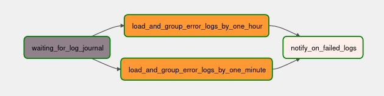

# Alert project

This project implements alert system for logs from various devices. Alerts are presented as emails.

Due to big amount of log files, Spark was used as data processing framework that can quickly perform processing tasks on very large data sets.
As a platform for developing, scheduling, and monitoring batch-oriented work flow Airflow is used.
Spark loads logs from file (can be changed to any Cloud Storage), group by conditions and Airflow sends alert on email if there is any problems. 

# Implementation details

All analyzing features are presented as [spark scripts](spark) and uses `spark-submit` command.
Currently, this project supports two filter options:

1) More than 10 fatal error alerts in less than one minute
2) More than 10 fatal error alerts in less than one hour for a specific bundle_id

DAG:



## Setting up email
First, we need to set up the SMTP configuration to send email from airflow. I consider using Gmail to set up the SMTP user and password in this session.
For generating password and setting up Gmail account check [this link](https://naiveskill.com/send-email-from-airflow/).

Don't forget to write down your credentials in .env file. Use [example.env](docker%2Fexample.env).

# Start with Docker
First of all, build all images:

```shell
docker build -t sherri-ice/airflow docker/airflow/
docker build -t sherri-ice/postgres-spark docker/postgres-spark
```

After build run:
```shell
docker compose up
```
# How to add new filters
Just write new spark script and place it in `spark/app` folder. Don't forget to use this script in `SubmitSparkOperator`.