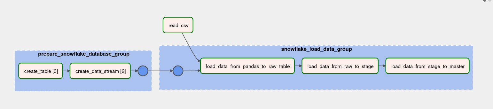
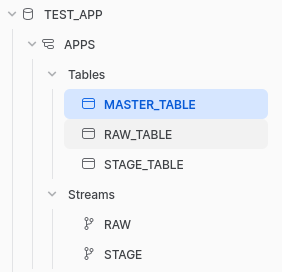
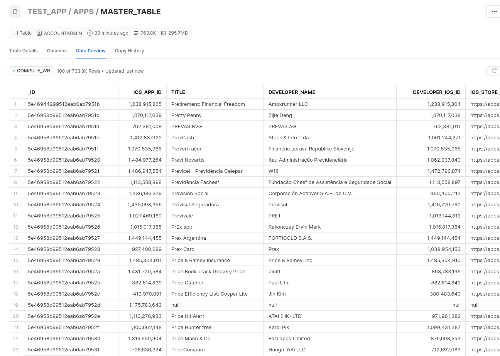

# Snowflake 

## About
This task is all about introduction to Snowflake. Need to build an ELT pipeline based on Snowflake using Airflow (local).

## Datasets
Dataset is not stored on Github due to its size (>2GB), but in this task dataset supposed to be on the same host as the code.
Feel free to add airflow environment variable `DATA_PATH` for dataset's path.

## Requirements
Ensure you have installed python, pip and airflow.
To install python dependencies run:
```shell
pip install -r requirements.txt
```

## Starting Airflow
Sadly, this task was not containerized with Docker, so you need to initialize airflow db and create user by your own:
```shell
airflow db init
```
```shell
airflow users create \
    --username admin \
    --password password \
    --firstname Firstname \
    --lastname Lastname \
    --role Admin \
    --email email@example.com
```
Also don't forget to edit `airflow.cfg` for enabling xcom pickling and not to load example dags:
```json
load_examples = False
enable_xcom_pickling = True
```
Finally, we can start airflow server and scheduler (worker will be started automatically). 

```shell
airflow webserver --port 8080
```

```shell
airflow scheduler
```

_Note: by default airflow uses SQLite for xcom pulling and SequentialExecutor as task executor, which may face xcom pulling limit for 2GB._
## Snowlfake credentials
I decided to put all credentials in airflow environment variables via GUI. Be sure to fill up all required credentials.
## Results



### Results on Snowflake backend

Created tables:



Final dataset at `MASTER_TABLE` in Snowflake:

