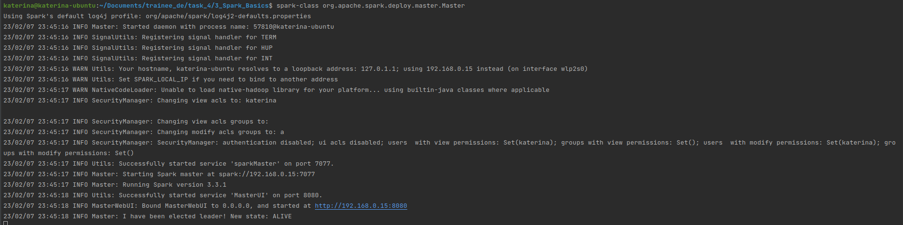
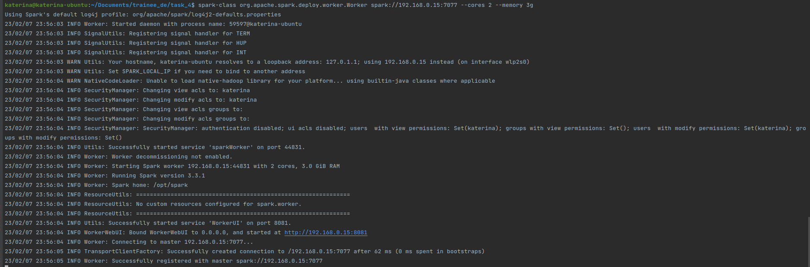
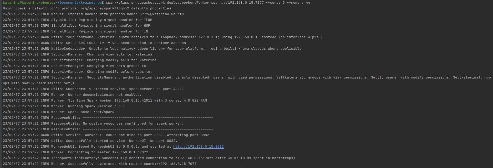
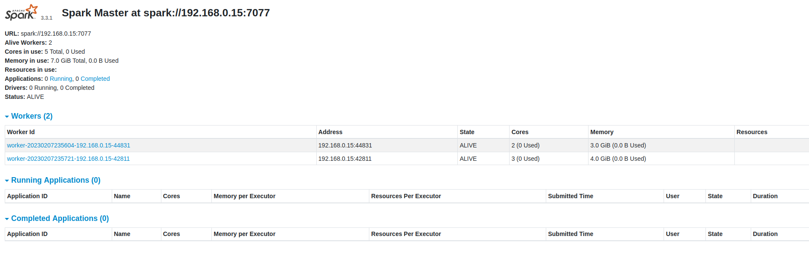
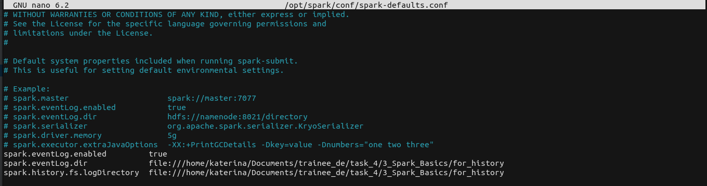
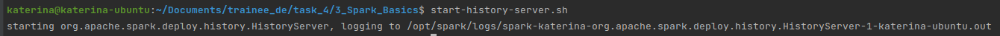
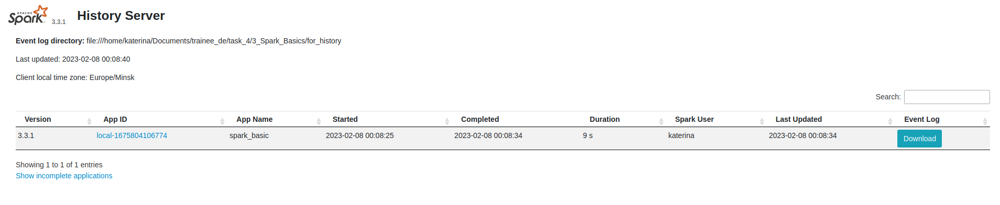
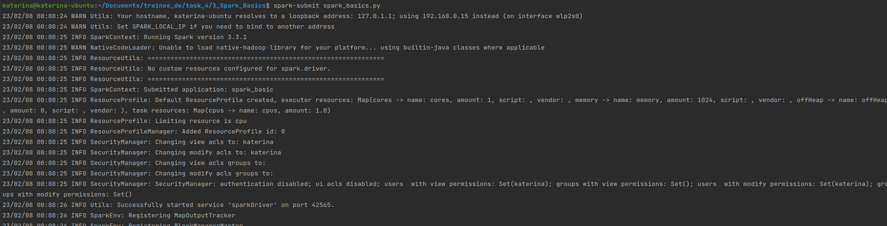
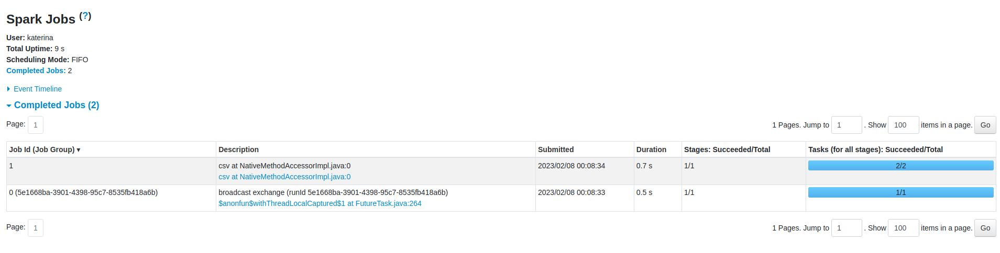
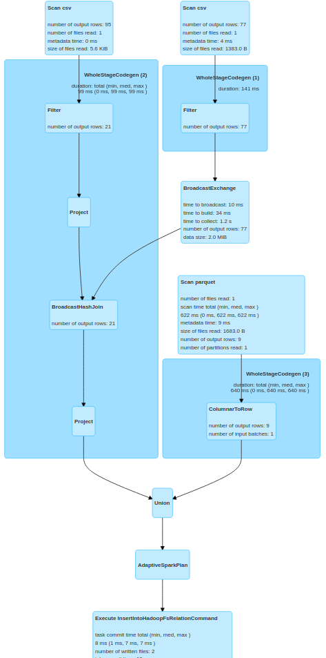

# Spark Demo Course

Theory and some useful links can be found here: [repository link](https://github.com/andrewD46/spark_demo_course/tree/main).

## Before the start
I used Ubuntu 22.04 as work system, all scripts and notes are about Spark on Linux.

## Task 3. Spark Basics.
Starting the Master node:

### Creating workers:

### Executing code with History Server
spark-default.conf, added logging:

Launching history server:

History server UI:

Executing Python code with Spark:

Results in History Server UI:

Execution plan:
